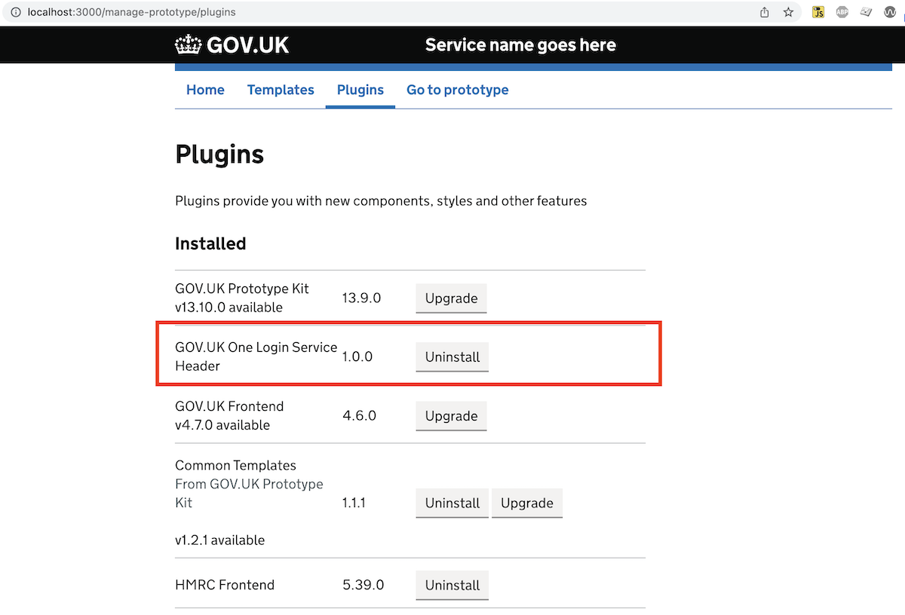
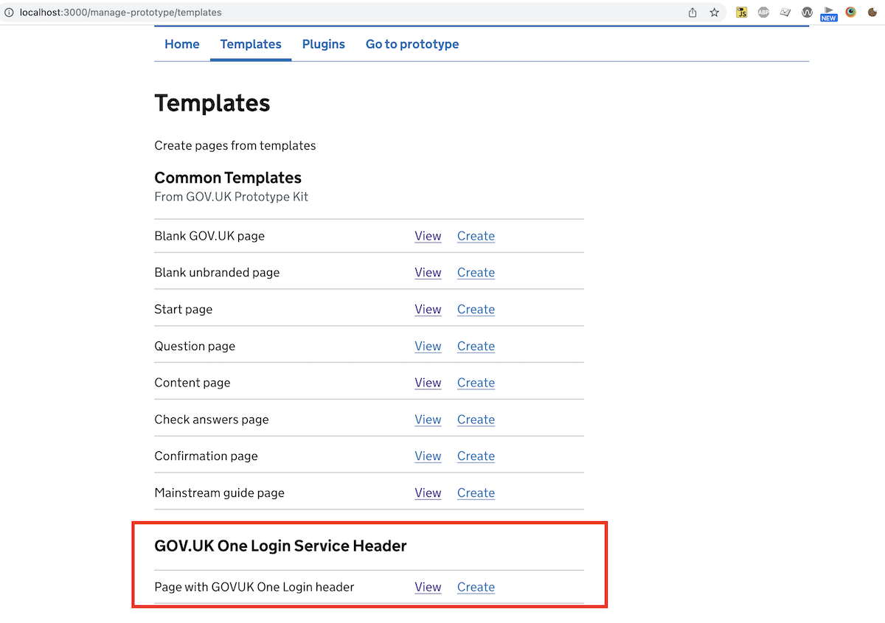

# How to install the header if you are using the Prototype Kit

## Install the header plugin 
Before you [start the kit](https://prototype-kit.service.gov.uk/docs/install/how-to-run-the-kit), run `npm install github:govuk-one-login/service-header` in your terminal. 

(Note: if you are using a Mac and seeing an error along the lines of `xcrun: error: invalid active developer path (/Library/Developer/CommandLineTools), missing xcrun at: /Library/Developer/CommandLineTools/usr/bin/xcrun.`, try running `xcode-select --install` before you run the `npm install` command above)

Now the header should appear in the list of installed plugins under the `/manage-prototype/plugins` page in your prototype. 

Note that once the header has been added to the list of available plugins published by the Prototype Kit team, you will be able to install the header by simply clicking the **Install** button on the `/manage-prototype/plugins` page.

## Create a page from the pre-existing template

To create a page in your prototype using a pre-built template containing the header, navigate to `/manage-prototype/templates` and create a new page from the "Page with GOVUK One Login header" template.

To set the service name that is displayed in the header, use the following syntax: <code>&lbrace;&percnt; set serviceName = "My example service name" &percnt;&rbrace;</code>.

As of v3.0.0 of the GOV.UK One Login Service Header, it includes the Design System [service navigation component](https://design-system.service.gov.uk/components/service-navigation/).
If you are using the latest version of the GOV.UK One Login Service Header, please make sure the GOV.UK Frontend plugin has also been updated to the latest version. You might experience errors otherwise.

The options in the Nunjucks macro options table on the Design System service navigation component page can be defined as Nunjucks template variables.

For example, <code>&lbrace;&percnt; set menuButtonText = "Custom Menu Button" &percnt;&rbrace;</code> will change the text of the service navigation mobile navigation menu toggle.

To set the list of navigation links , use the following syntax:
<pre><code>
&lbrace;&percnt; set navigation = [
    {
      href: "#nav1",
      text: "Navigation item 1"
    },
    {
      href: "#nav2",
      text: "Navigation item 2",
      active: true
    },
    {
      href: "#nav3",
      text: "Navigation item 3"
    }
  ]
&percnt;&rbrace; 
</code></pre>
The fields indicate as follows:
- `href` indicates the link destination, 
- `text` is the text being displayed, 
- `active` this is an optional parameter which indicates that the user is within this group of pages in the navigation hierarchy. It adds an underline to the link.

To overwrite the destination for the GOV.UK link in the header, use <code>&lbrace;&percnt; set homepageLink = "https://example.service.gov.uk/" &percnt;&rbrace;</code>. The link goes to "https://www.gov.uk/" by default.

To overwrite the destination for the One Login link in the header, use <code>&lbrace;&percnt; set oneLoginLink = "https://example.service.gov.uk/" &percnt;&rbrace;</code>. The link goes to "https://home.account.gov.uk/" by default.

To overwrite the destination for the sign out link in the header, use <code>&lbrace;&percnt; set signOutLink = "https://example.service.gov.uk/sign-out" &percnt;&rbrace;</code>. The link goes to "https://home.account.gov.uk/sign-out" by default.

To set header language to Welsh, use &lbrace;&percnt; set lng = "cy" &percnt;&rbrace;. 

Add the `set` statements listed above after the `extends` line at the top of the file.

## Use the header component in an existing page or template

If instead of using the template installation described above, you want to include the header component into one of your existing layouts or templates, the component can be imported using the syntax: 
<code>&lbrace;&percnt; from "service-header/service-header.njk" import govukOneLoginServiceHeader &percnt;&rbrace;</code>

The component can then be used like so: 
<pre><code>
&lbrace;&percnt; block header &percnt;&rbrace;
  &lbrace;&lbrace; govukOneLoginServiceHeader({
    signOutLink: "/test-signout",
    oneLoginLink: "/test-one-login",
    lng: "cy",
    serviceNavigationParams: { 
      navigation: [
      {
        href: "#navigation1", 
        text: "Navigation item 1" 
      },{
        href: "#navigation2", 
        text: "Navigation item 2",
        active: true
      },{
        href: "#navigation3", 
        text: "Navigation item 3"
      }], 
      serviceName: "Test service name",
      navigationLabel: "Test label" 
    }
  }) &rbrace;&rbrace;
&lbrace;&percnt; endblock &percnt;&rbrace;
</code></pre>

## How to update the header if you are using the Prototype Kit 

You may not receive updates or bug fixes automatically. 

To update the header to the most recent version, please run `npm update @govuk-one-login/service-header` in your terminal.