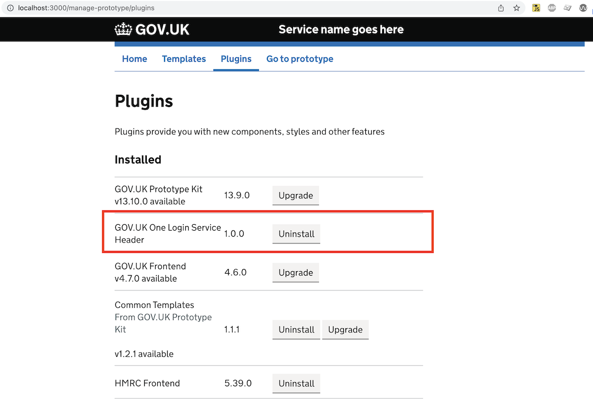
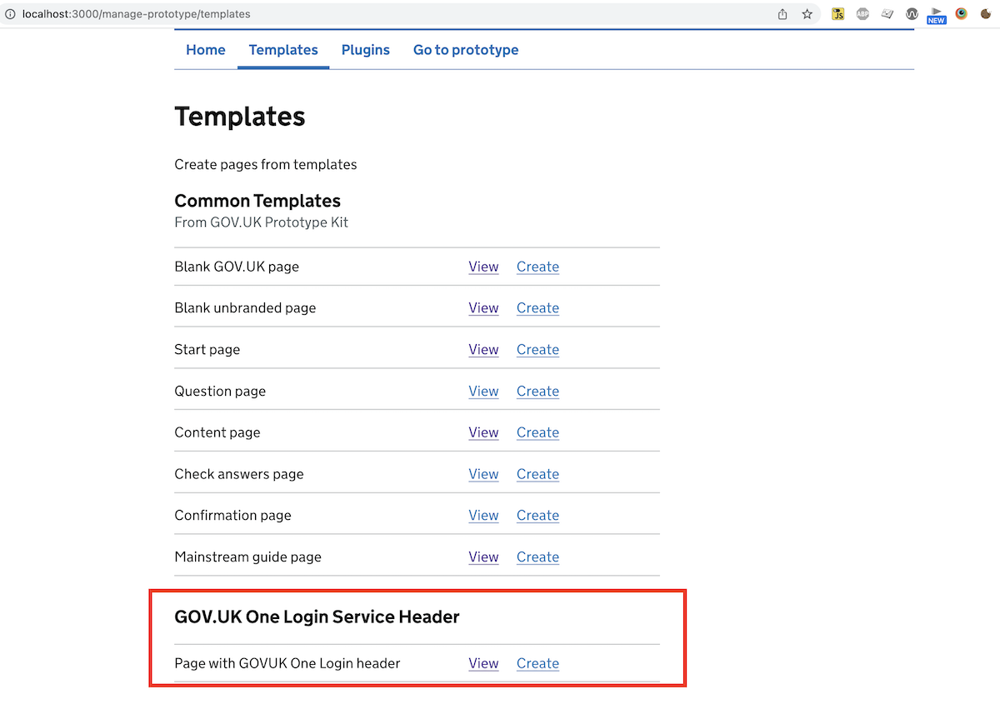

# How to install the header if you are using the Prototype Kit

## Install the header plugin 
Before you [start the kit](https://prototype-kit.service.gov.uk/docs/install/how-to-run-the-kit), run `npm install @govuk-one-login/service-header` in your terminal. 

(Note: if you are using a Mac and seeing an error along the lines of `xcrun: error: invalid active developer path (/Library/Developer/CommandLineTools), missing xcrun at: /Library/Developer/CommandLineTools/usr/bin/xcrun.`, try running `xcode-select --install` before you run the `npm install` command above)

Now the header should appear in the list of installed plugins under the `/manage-prototype/plugins` page in your prototype. 

Note that once the header has been added to the list of available plugins published by the Prototype Kit team, you will be able to install the header by simply clicking the **Install** button on the `/manage-prototype/plugins` page.

## Create a page from the pre-existing template

To create a page in your prototype using a pre-built template containing the header, navigate to `/manage-prototype/templates` and create a new page from the "Page with GOVUK One Login header" template.

To overwrite the destination for the GOV.UK link in the header, use <code>&lbrace;&percnt; set homepageLink = "https://example.service.gov.uk/" &percnt;&rbrace;</code>. The link goes to "https://www.gov.uk/" by default.

To overwrite the destination for the One Login link in the header, use <code>&lbrace;&percnt; set oneLoginLink = "https://example.service.gov.uk/" &percnt;&rbrace;</code>. The link goes to "https://home.account.gov.uk/" by default.

To overwrite the destination for the sign out link in the header, use <code>&lbrace;&percnt; set signOutLink = "https://example.service.gov.uk/sign-out" &percnt;&rbrace;</code>. The link goes to "https://home.account.gov.uk/sign-out" by default.

To set header language to Welsh, use &lbrace;&percnt; set lng = "cy" &percnt;&rbrace;. 

Add the `set` statements listed above after the `extends` line at the top of the file.

To customise the service navigation component, follow the instructions on this [page](https://prototype-kit.service.gov.uk/docs/how-to-use-layouts).

## Use the header component in an existing page or template

If instead of using the template installation described above, you want to include the header component into one of your existing layouts or templates, the component can be imported using the syntax: 
<code>&lbrace;&percnt; from "service-header/service-header.njk" import govukOneLoginServiceHeader &percnt;&rbrace;</code>

The component can then be used like so: 
<pre><code>
&lbrace;&percnt; block govukHeader &percnt;&rbrace;
  &lbrace;&lbrace; govukOneLoginServiceHeader({
    signOutLink: "/test-signout",
    oneLoginLink: "/test-one-login",
    homepageLink: "/your-prototype-homepage",
    lng: "cy"
  }) &rbrace;&rbrace;
&lbrace;&percnt; endblock &percnt;&rbrace;
</code></pre>

As of service header version 6.0.0, the service navigation component has been decoupled from the GOV.UK One Login service header.

If your service requires a service navigation, please import the [service navigation component](https://design-system.service.gov.uk/components/service-navigation/) from the Design System.

Add it separately, after the `govukOneLoginServiceHeader`, as follows:

<pre><code>
&lbrace;&percnt; block govukHeader &percnt;&rbrace;
  &lbrace;&lbrace; govukOneLoginServiceHeader({
    signOutLink: "/test-signout",
    oneLoginLink: "/test-one-login",
    lng: "cy"
  }) &rbrace;&rbrace;

  &lbrace;&lbrace; govukServiceNavigation({
  serviceName: "Service name",
  serviceUrl: "#",
  navigation: [
    {
      href: "#",
      text: "Navigation item 1"
    },
    {
      href: "#",
      text: "Navigation item 2",
      active: true
    },
    {
      href: "#",
      text: "Navigation item 3"
    }
  ]
}) &rbrace;&rbrace;
&lbrace;&percnt; endblock &percnt;&rbrace;
</code></pre>

## How to update the header if you are using the Prototype Kit 

You may not receive updates or bug fixes automatically. 

To update the header to the most recent version, please run `npm update @govuk-one-login/service-header` in your terminal.